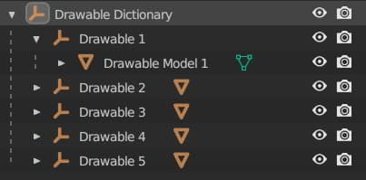
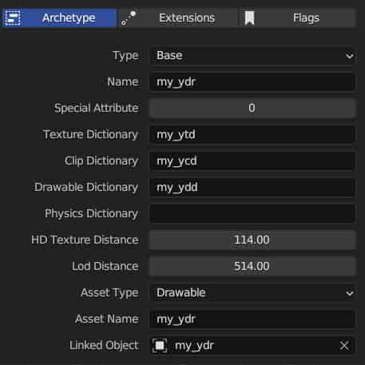

# 🗂 Drawable Dictionary (.ydd)

The Drawable Dictionary is a container that holds a collection of drawables. Its primary use is for storing LOD models, ped components, ped props, mesh minimaps and instanting props.

It is recommended that you read the Drawable documentation page before creating a Drawable Dictionary, as it consists of drawables.


[drawables-.ydr](../drawables.ydr)


### File Layout

```
Drawable Dictionary
    Drawable#1
        ShaderGroup
        Skeleton (sometimes, mostly seen on ped component)
        DrawableModelsHigh
        DrawableModelsMed
        …
    Drawable#2
    Drawable#3
    Drawable#4
    Drawable#5
    …
```

For the hierarchy, several drawables exist as regular game-ready assets, but all of them shared one parent drawable dictionary object.

### Blender Hierarchy

<div align="left" data-full-width="false">
 <figure>
  
  <figcaption>
   <p>Example Drawable Dictionay object</p>
  </figcaption>
 </figure>
</div>

In Blender, Drawable Dictionaries comprises a parent object and one or more drawable objects in its hierarchy.

### Limitation

Some features of Drawable objects cannot be inherited by Drawable Dictionaries.  
For example, the embedded collision **cannot function** when the drawable is in a drawable dictionary.  
Furthermore, CodeWalker cannot identify the real name of a drawable in drawable dictionaries unless a nametable with resolved names is loaded. Thus, it is recommended to create a nametable whenever utilizing a drawable dictionary in your project to facilitate your own and others' modding processes.

### Archetype Definition


A Drawable Dictionary does not have its archetype definition.


When creating the archetype definition for a drawable in a drawable dictionary, it is necessary to fill the correct name of your drawable dictionary in the "Drawable Dictionary" blank to ensure it workds within the game.

For instance, if we have the drawable dictionary `my_ydd` and the drawable `my_ydr` in the scene. Then you should fill in "Drawable Dictionary" in the archetype as shown in the picture below:

<div align="left" data-full-width="false">
 <figure>
  
  <figcaption>
   <p>Fill the "Drawable Dictionary" with the name of your drawable dictionary</p>
  </figcaption>
 </figure>
</div>


If you use thr "Auto-Create From Selected" function, the "Drawable Dictionary" will be filled in automatically.
