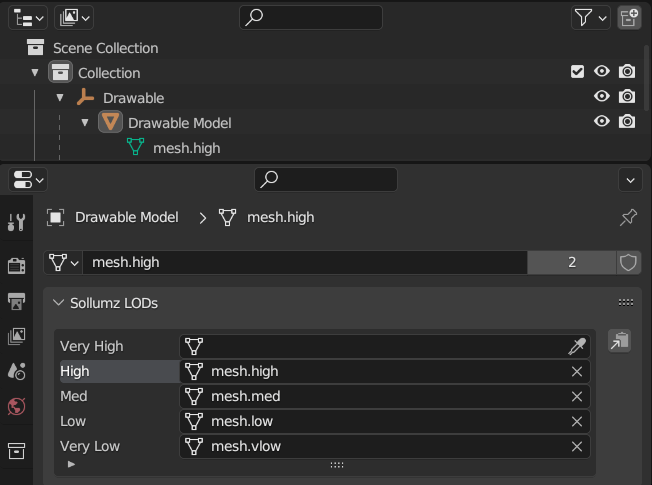
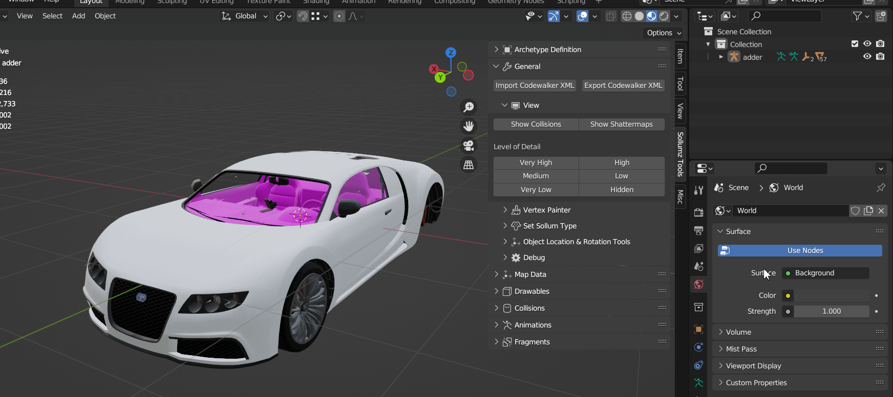
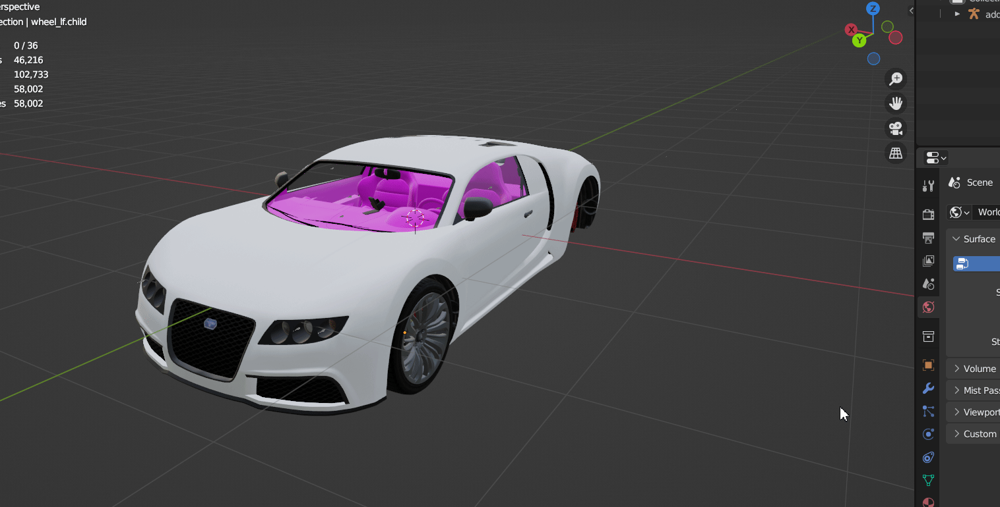
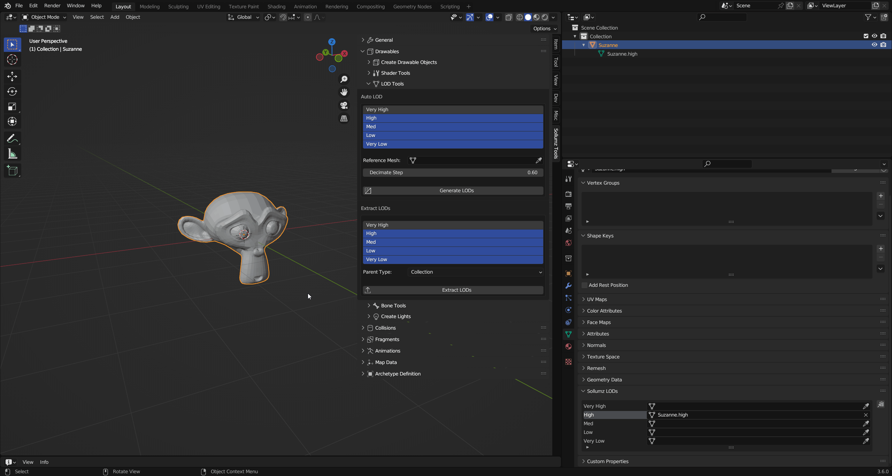
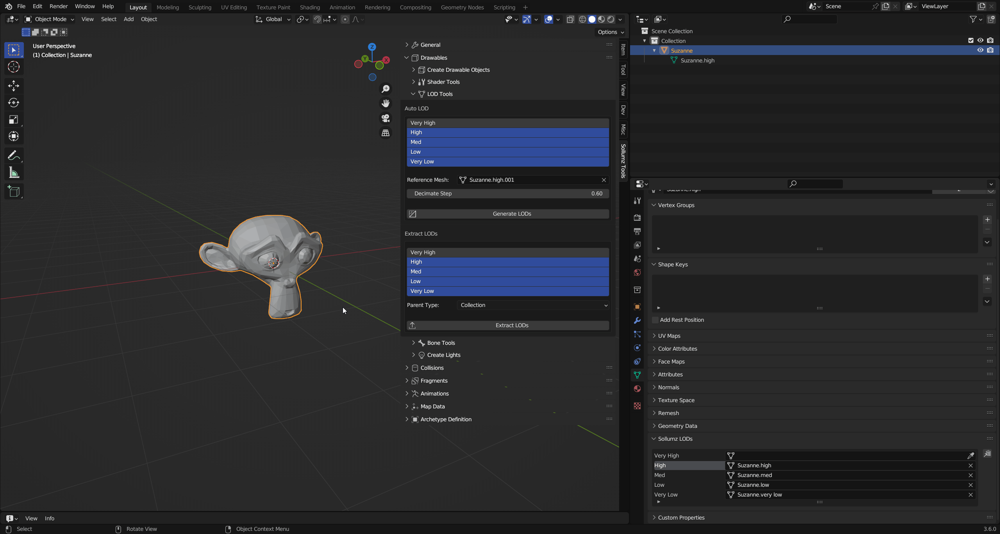
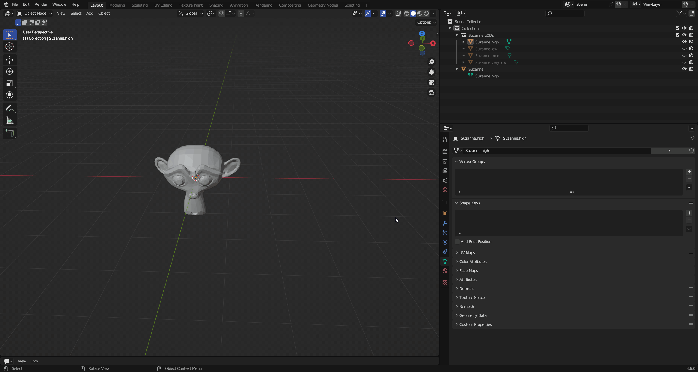

# Level of Detail (LODs) Editing

The LODs for each Drawable Model can be edited in the `Mesh Properties > Sollumz LODs` panel. As mentioned before, there are 4 LOD levels: **High**, **Medium**, **Low**, and **Very Low**. You will also see the "Very High" LOD level, but that is only used for YFT vehicles (see Fragments > [Vehicle Setup](../fragments-.yft/vehicle-setup/#import-with-\_hi)).

<figure><figcaption>
Mesh Properties > Sollmz LODs
</figcaption></figure>

### Setting LOD Level

For each LOD level, you can select the mesh it will use. You can also select any LOD level from the list and it will swap out the mesh that the Drawable Model uses.

<figure><figcaption>
Swapping LOD meshes
</figcaption></figure>

LODs can also be changed for the entire hierarchy at once in the `Sollumz Tools > General > View` panel.

<figure><figcaption>
Sollumz Tools > General > View
</figcaption></figure>

Alternatively, press `Shift + V` to open a pie menu for quickly viewing different LOD levels.

<figure><figcaption>
LODs pie menu (Shift + V)
</figcaption></figure>

### Auto LOD Tool

Sollumz provides a basic LOD generation tool that uses the decimate modifier.

Select the Drawable Model and Navigate to `Sollumz Tools > Drawable > LOD Tools`.

<figure><figcaption>
Sollumz Tools > Drawable > LOD Tools
</figcaption></figure>

From here you can select which LOD levels will get created. Normally you'd model the highest LOD first, convert to a Drawable Model, then use that high LOD mesh as the reference mesh. The reference mesh is not affected in this process. Each subsequent LOD level is decimated by `Decimate Step`.

<figure><figcaption>
Generating LODs using Suzanne.high
</figcaption></figure>

Your results will vary depending on the mesh, as the decimate modifier does not work well for all topologies.&#x20;

### Extracting LODs into Separate Objects

You can also take advantage of Blender's instancing functionality and separate the LOD meshes into separate objects. This allows you to work on multiple LOD meshes at once.

Select the Drawable Model and Navigate to `Sollumz Tools > Drawable > LOD Tools`.

<figure><figcaption>
Sollumz Tools > Drawable > LOD Tools
</figcaption></figure>

From here you can select which LODs to extract as well as what to parent the new objects to. You can either parent the objects to a collection or an empty object.

<figure><figcaption>
Extract LODs
</figcaption></figure>

Notice how these new objects are using the same meshes as the ones defined in the `Sollumz LODs` panel.

<figure><figcaption>
Mesh Properties > Sollumz LODs
</figcaption></figure>

Now, if you edit one of these object instances, the Drawable Model will be affected too.

<figure><figcaption>
Editing Suzanne.high
</figcaption></figure>

