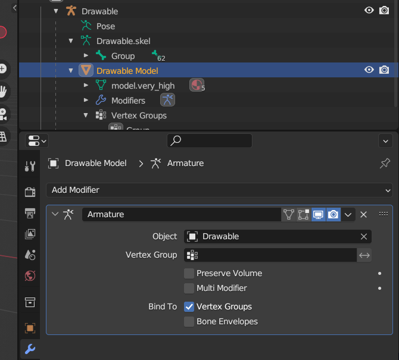
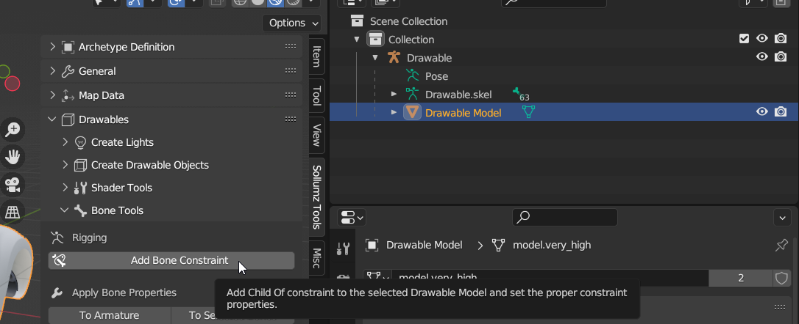

# Rigging

Drawables can be rigged using either vertex groups (skinning) or Child Of constraints. The top-level Drawable object must be an armature.

### Skinning

Skinning Drawables works the same way you would normally do it in Blender. Simply create vertex groups where each group's name corresponds to a bone in the armature. Then, add an armature modifier and specify the Drawable as the armature object.

<figure><figcaption>
Drawable Model setup for skinning
</figcaption></figure>

### Linking bones to Drawable Models

Many Drawables aren't rigged using weighted vertex groups. You can instead link an entire Drawable Model to a bone by using a Child Of constraint.

<figure><figcaption>
Sollumz Tools > Drawable > Bone Tools
</figcaption></figure>

Use the "Add Bone Constraint" operator with the Drawable Model Selected to add a Child Of Constraint with the properties setup for correct previewing.

<figure><figcaption>
Example Child Of Constraint for a Drawable Model
</figcaption></figure>


By default, Blender sets the owner space and target space of the Child Of constraint to "World" (can be edited in the Sollumz sub-panel of the Child Of constraint). This can cause issues when objects are parented to both bones and other objects. Because of this, **make sure to always use the Add Bone Constraint tool when creating Child Of constraints.**

