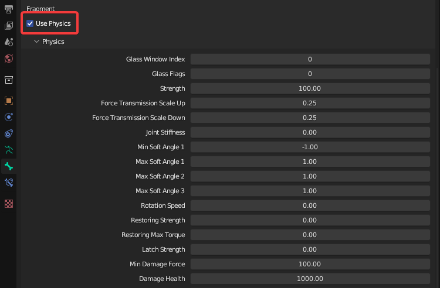

# Bone Physics

You will notice that each Fragment bone now has a `Use Physics` property.

<figure><figcaption>
Bone Properties > Sollumz > Fragment
</figcaption></figure>

Enabling this will reveal a `Physics` subpanel where various physics properties can be configured for that bone. The defaults work great for most use cases but feel free to tweak them to get the results you want.&#x20;


If you're ever not sure what physics properties to set, import a similar model from the game and copy its physics properties.


Most importantly, enabling Use Physics is what causes the bone to react to physics. If this is unticked, any geometry associated with the bone will always remain static in-game. Usually, you'd have a bone for each separable part. That way, all parts of your Fragment will act independently of each other. See the [Prop Setup](prop-setup.md) page for an example (vehicles also have separable parts but the bone hierarchy is usually much more complex).


Strength is what determines how easily the part can be separated. If strength is -1, the part will not separate, but will still react to physics. This can be seen in props with hinging doors such as the container prop shown in [Prop Setup](prop-setup.md#skeleton-setup).

