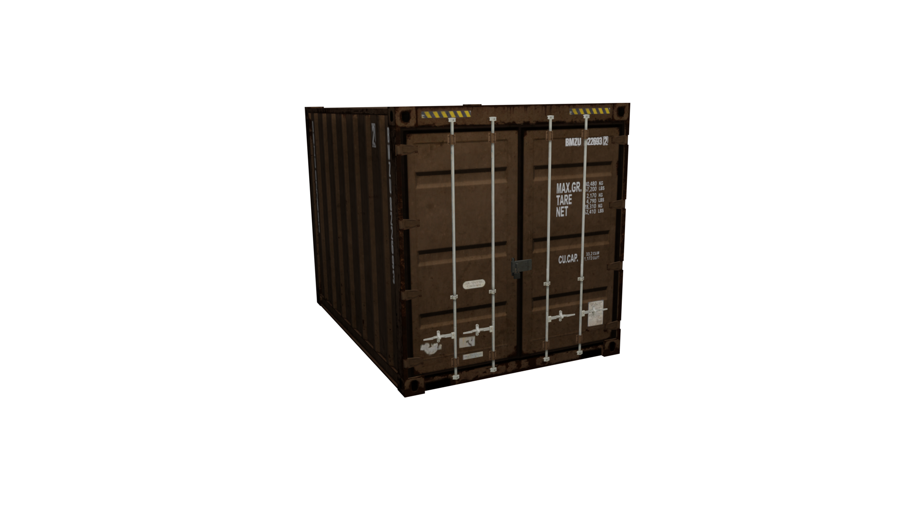

# Prop Setup

The example prop used in this article is `prop_container_05a.yft`

<figure><figcaption>
prop_container_05a.yft
</figcaption></figure>

### Fragment Hierarchy

<figure><figcaption>
prop_container_05a Blender hierarchy
</figcaption></figure>

### Prop Rigging

You'll also notice that each Drawable Model is rigged using a Child Of constraint instead of vertex groups.

<figure><figcaption>
prop_container_05a.mesh
</figcaption></figure>

This is the case for all props. Typically each Drawable Model for a prop corresponds to a particular separable part of the Fragment. Notice there is a Drawable Model for the latch, each door, and the container itself.

### Skeleton Setup

This matches up with the bone hierarchy.

<figure><figcaption>
prop_container_05a.skel
</figcaption></figure>

Each bone is parented to `Prop_Container_05a` and is thus affected by that bone. Every skeleton in the game engine always has one root bone that all the other bones are parented to.


If you attempt to add multiple top-level bones (bones with no parent) you will run into issues. Make sure there is a single "root" bone that all other bones are parented to!


Notice, too, that each bone has `Use Physics` enabled. This means that each of those parts will have physics in-game and will separate from each other.&#x20;

<figure><figcaption></figcaption></figure>


In this case, the doors don't actually "separate" from the mesh, but fling open instead. This is because the `Strength` bone physics property is set to -1. When set to another value (i.e. 100) you'll notice that the parts will separate.


<figure><figcaption>
With Strength set to 100 for both doors
</figcaption></figure>

### Collisions

As mentioned before, each bone with physics enabled must have an associated collision. However, there can be multiple collisions for a single bone. Notice for this prop, there is a single collision for the latch and the doors, but the container itself is comprised of 5 box collisions.

<figure><figcaption>
prop_container_05a.col
</figcaption></figure>


You will notice that a lot of vanilla collisions will use bound shapes wherever possible. This is typically preferred over using a bound mesh as it is much more performant. **Keep collisions as simple as possible.**


Each of these collision objects is linked to a bone via a Child Of Constraint.

<figure><figcaption>
Prop_CDoor_L.col constraints panel
</figcaption></figure>

Each collision also has its mass set in the `Object Properties > Sollumz > Physics` panel.

<figure><figcaption>
Object Properties > Sollumz > Physics
</figcaption></figure>

