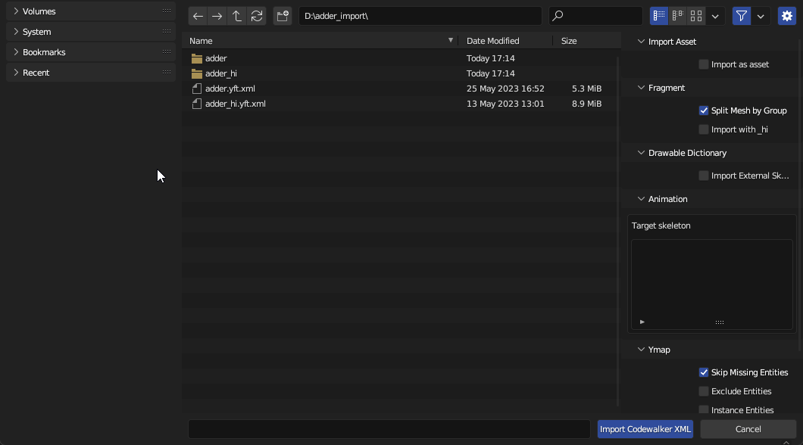

# Import Settings

There are two import settings that determine how Fragments import: `Split By Group` and `Import with _hi`.

<figure><figcaption>
Import Codewalker XML > Fragment
</figcaption></figure>

#### Split By Group

Split By Group will split the Drawable by vertex group. This is typically what you want when editing vehicles, as vehicles are skinned (i.e. rigged with weighted vertex groups), so there is typically only one Drawable Model containing many vertex groups as opposed to multiple Drawable Models each linked to a bone (see [Drawables > Rigging > Skinning](../../drawables-.ydr/rigging.md#skinning) for more info on rigging Drawables).

Here is what `adder.yft` looks like when split by group.

<figure><figcaption>
adder.yft split by vertex group
</figcaption></figure>

Notice how each object represents a separable part of the vehicle. Since it's split by vertex group, each object will only have one vertex group.

<figure><figcaption>
bodyshell
</figcaption></figure>


While the Drawable is initially set up with one vertex group per object, it is perfectly fine for an object to contain multiple vertex groups.


Each object also has an armature modifier with the Fragment as the target object.

#### Import with \_hi

Vehicle Fragments have an additional LOD level that is stored in a separate file named `<fragment name>_hi.yft`. For adder, it would be called `adder_hi.yft`. This is the highest level of detail and is what the player sees when close to the vehicle (i.e. when driving). It is very cumbersome to work on two separate YFTs so Sollumz stores this extra LOD level in the `Very High` LOD level. This enables you to work on both YFTs at once.


You should only use this LOD level when working with vehicles. When a mesh is provided for the `Very High` LOD level, Sollumz will export an extra \_hi YFT that you don't need when working on props.


To import `Very High` LODs, first enable the `Import with _hi` option in the[ import settings panel](import-settings.md#import-settings), and ensure the \_hi YFT is in the same directory as the non-hi YFT. Then, **select the non-hi YFT** and import.

<figure><figcaption>
Importing adder.yft.xml with hi
</figcaption></figure>


As with any Fragment/Drawable, if you want the textures to be automatically imported with the mesh, ensure you extract all textures to a folder with the **same name as the Fragment** in the **same directory**.

