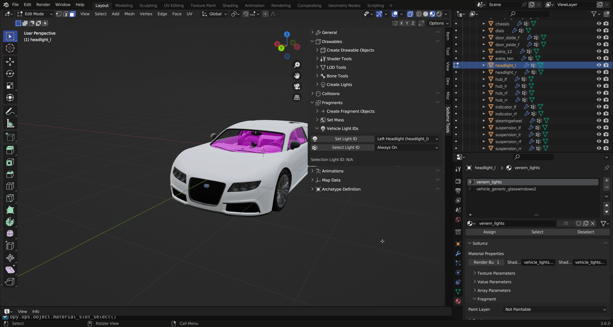

# Light IDs

Any mesh with `vehicle_lightsemissive` shaders will appear always emissive in-game unless light IDs are assigned. Assigning light IDs allow you to make some faces only appear emissive under certain conditions (i.e. headlights on/off). Sollumz makes assigning light IDs easy.

With a headlight object selected, enter `Edit Mode` in `Face Selection` mode and navigate to the `Sollumz Tools > Fragment > Vehicle Light IDs` panel.

<figure><figcaption>
Sollumz Tools > Fragment > Vehicle Light IDs
</figcaption></figure>

Select the faces of the left headlight that use the emissive shader, then set its light ID to `headlight_l`.

<figure><figcaption>
Setting left headlight light IDs
</figcaption></figure>

Notice now that if you unselect those faces, and select the `headlight_l` light ID, it will select those faces you just assigned.

<figure><figcaption>
Selecting light IDs
</figcaption></figure>

