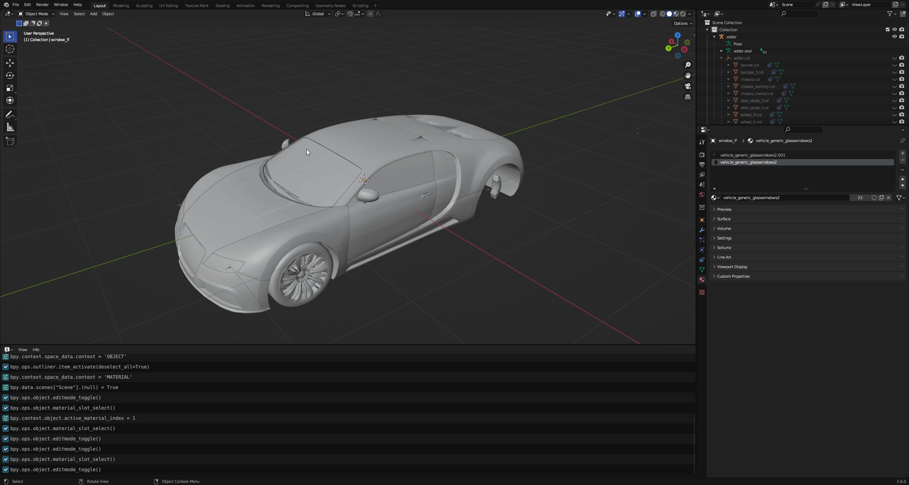

# Vehicle Windows

Vehicle windows are defined in the physics properties of the window collision. See `window_lf.col` in `adder.yft` for example.

<figure><figcaption>
 window_lf.col | Object Properties > Physics
</figcaption></figure>

Enabling `Is Glass Window` will cause the window properties to appear. The only property you should have to change here is the `Window Material`. This is the material that the corresponding window mesh uses. Looking at the `window_lf` mesh materials, we see that it uses two `vehicle_generic_glasswindows2` materials.

<figure><figcaption>
window_lf | Materials
</figcaption></figure>

This is because one material represents the inner glass and the other represents the outer glass. Go into Edit Mode and select the vertices of each material to see which one represents the outer glass. In this case, it's the material without the ".001" so that's the one that the glass window should reference.&#x20;

<figure><figcaption>
Determining which material is the outer glass material
</figcaption></figure>

That's all that is needed for working vehicle windows!

### Shattermaps

You will notice that all vanilla vehicles have "shattermaps", which is an image that defines the border of the glass-breaking pattern. These aren't 100% necessary for working vehicle windows but will result in better-looking glass shatter patterns.

In Sollumz, shattermaps are represented as planes with a single texture. For example, `adder.yft` has an object called `windscreen_shattermap` which is parented to `windscreen.col`.

<figure><figcaption>
windscreen_shattermap
</figcaption></figure>

These are always low-res bitmap greyscale textures. Currently, Sollumz has no tools for creating shattermaps, so your best bet is to copy shattermaps from vanilla files and work off of those.
