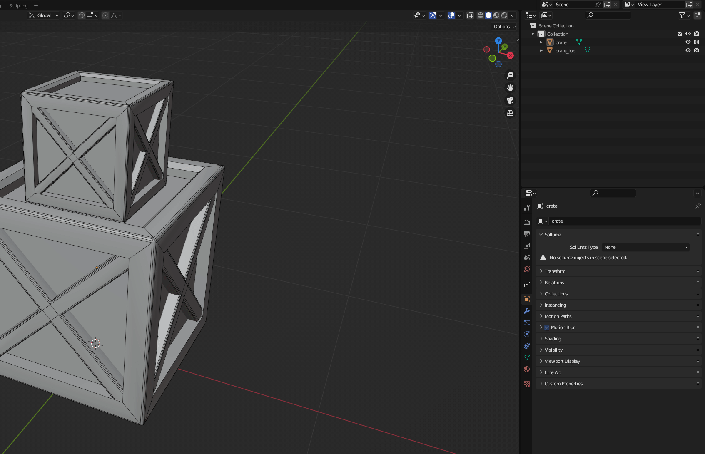
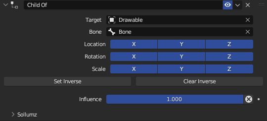
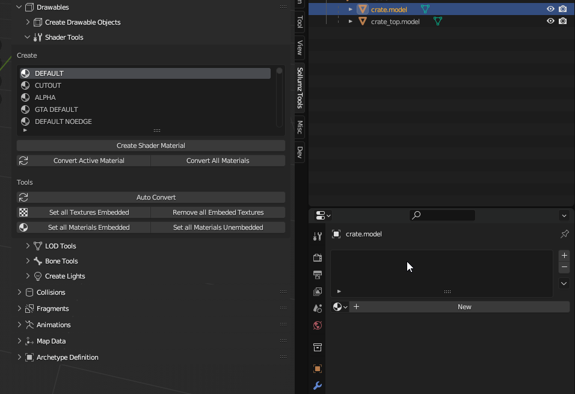
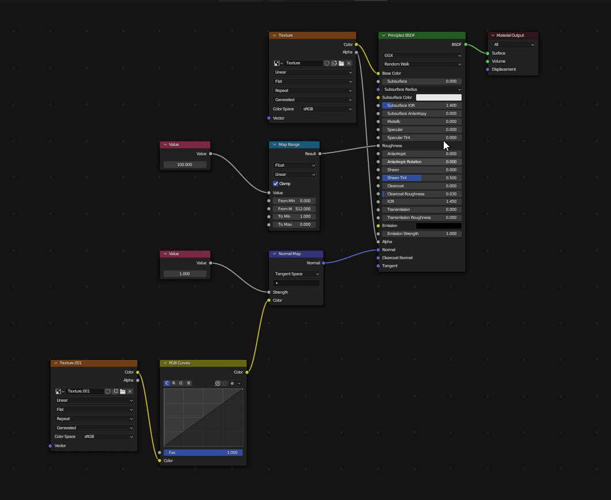
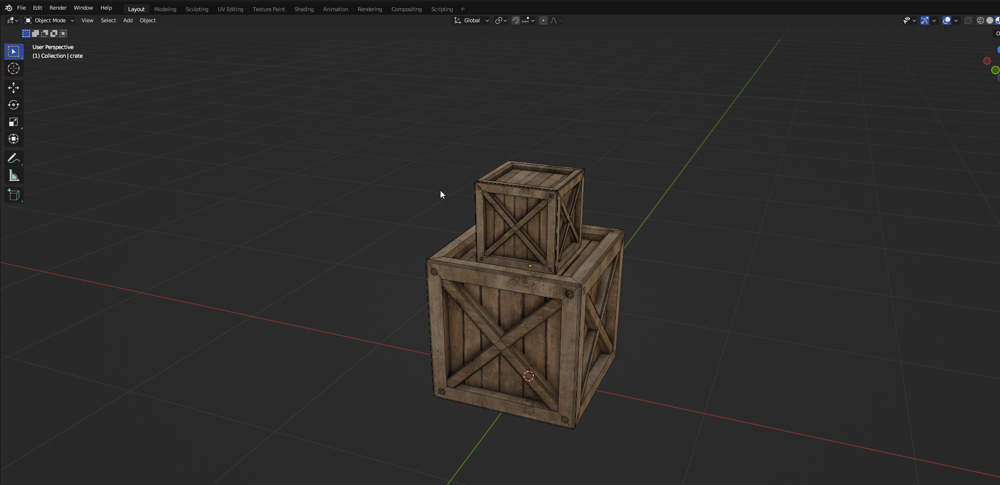
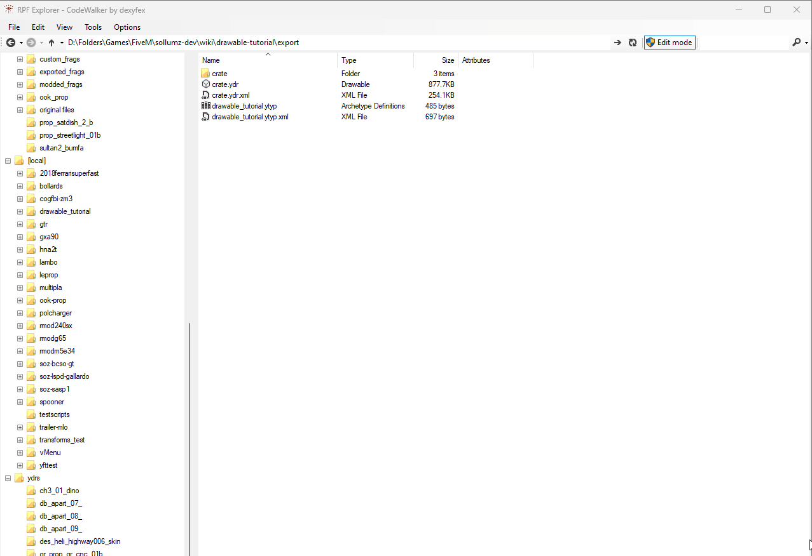
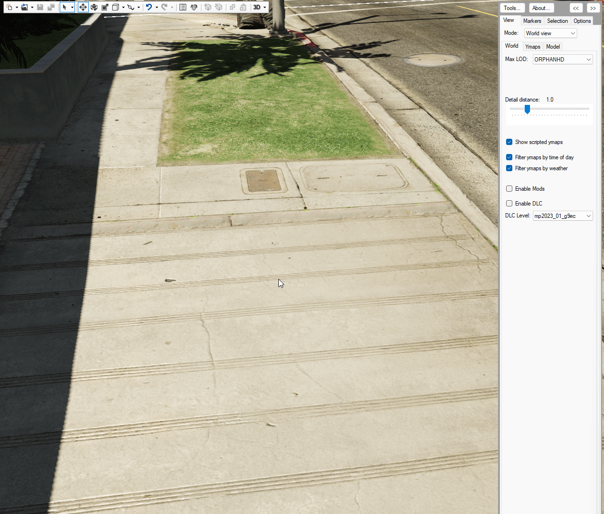

# 🌐 Creating Static Meshes

Game meshes are stored in the [Drawable (.ydr)](../documentation/drawables-.ydr/) file format. Creating Drawables in Sollumz is very simple. This tutorial will walk you through step-by-step.

### Prerequisite Knowledge

* Basic Blender skills ([This is a great place to start](https://www.youtube.com/playlist?list=PLjEaoINr3zgFX8ZsChQVQsuDSjEqdWMAD))
* Know how to create YMAPs to place objects in CodeWalker ([Here's a basic tutorial](https://www.youtube.com/watch?v=W0YPabgu8oo))
* Know how to either stream assets in a FiveM server or load mods into the base-game

### What you will need

* A UV-mapped 3D mesh of your choice
* Textures for the mesh

You can also follow along with the tutorial by using the assets below:&#x20;



### Converting to a Drawable

The first thing to do is convert your object(s) to a Drawable. Select all the objects and click `Convert to Drawable` in `Sollumz Tools > Drawable > Create Drawable Objects`.

<figure><figcaption>
Converting to Drawable
</figcaption></figure>

You'll notice that an empty object gets created called "Drawable" and the objects that were selected are now Drawable models.

<figure><figcaption>
Drawable hierarchy
</figcaption></figure>

If you navigate to `Mesh Properties > Sollumz LODs` you'll also notice that the active mesh is automatically assigned to the "High" LOD level. This panel is where you can assign other meshes as LODs. More info on that [here](../documentation/drawables-.ydr/level-of-detail-lods-editing.md). For the sake of this tutorial, we will only be setting the High LOD level.

<figure><figcaption>
Mesh Properties > Sollumz LODs
</figcaption></figure>

### Adding Materials

Next, we need to add materials to the Drawable Models. With one of the Drawable Models selected, open the `Sollumz Tools > Drawable > Shader Tools` panel. For this tutorial, I will use the "NORMAL" shader which allows us to specify a base color and a normal map. Search for the "NORMAL" shader and click `Create Shader Material`.&#x20;

<figure><figcaption>
Creating Sollumz material
</figcaption></figure>

With the newly added material selected, head to the shading tab and assign your textures.

<figure><figcaption>
Assigning textures
</figcaption></figure>

Repeat the process for any other Drawable Models. In my case, I am just going to use the same material for the "crate\_top" Drawable Model.

### Embedding Textures

Lastly, we need to set the textures as embedded. This will embed the textures into the YDR file, so we don't have to create a texture dictionary file (.ytd). With both objects selected, navigate to `Sollumz Tools > Drawable > Shader Tools` and click `Set all Materials Embedded.`

<figure><figcaption>
Sollumz Tools > Drawable > Shader Tools > Set All Materials Embedded
</figcaption></figure>

### Exporting

Before exporting I'm going to rename my Drawable to something more descriptive like "crate". Once you're happy with everything, export the Drawable by clicking File > Export > Codewalker XML. I am going to also enable `Export with ytyp`. This will automatically generate a YTYP with the Drawable we created already defined.

<figure><figcaption>
File > Export > Codewalker XML
</figcaption></figure>


You can also import/export via the Sollumz pie menu by pressing V and choosing "Export CodeWalker XML"


Your Drawable is now ready to be loaded into the game!

### Getting Files Ready to Stream

Convert the ydr.xml and ytyp.xml using CodeWalker.

<figure><figcaption></figcaption></figure>

Open the converted files in a CodeWalker project.

<figure><figcaption></figcaption></figure>

Add a YMAP to the project and add the newly created Drawable as an entity.

<figure><figcaption></figcaption></figure>

Position the entity to your liking, then export the YMAP.


Don't forget to calculate YMAP flags and extents!


<figure><figcaption></figcaption></figure>


Don't forget to generate \_manifest.ymf for your project!


<figure><figcaption></figcaption></figure>

Now, load your YDR, YTYP, YMAP, and \_manifest.ymf into either an RPF or the stream folder of your FiveM resource.

### Test In-Game

That's it! Load into the game and check out your creation!&#x20;

<figure><figcaption></figcaption></figure>


Note that your character will not collide with the Drawable as we have not created collisions for it. See [Creating Static Collisions](creating-static-collisions.md) to learn how to create collisions.

