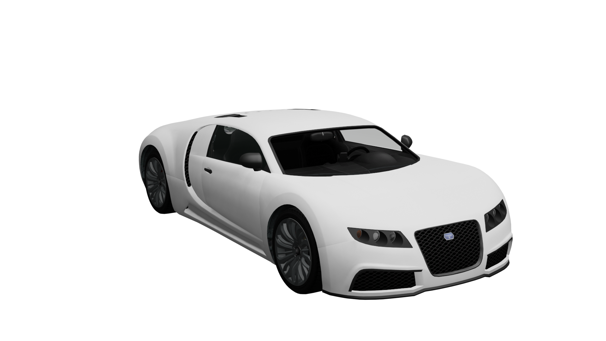

# 🚙 Creating Vehicles

The example vehicle used in this article is `adder.yft`

<figure><figcaption>
adder.yft
</figcaption></figure>


Before creating a new vehicle, make sure you have read the Vehicle Setup pages in Fragment documentation.


### Contents

