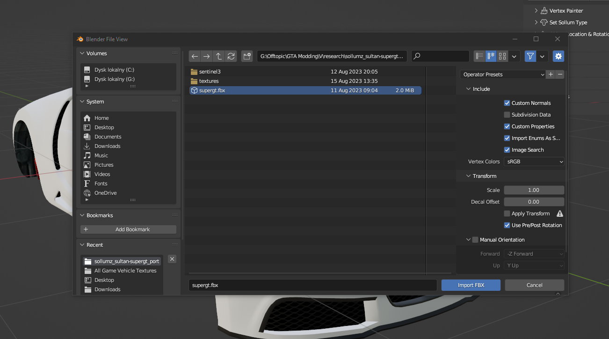
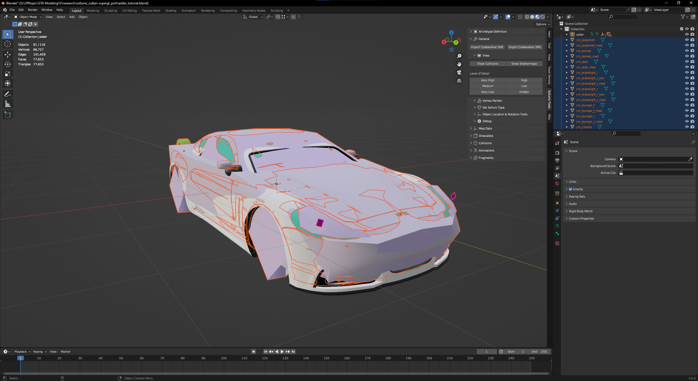
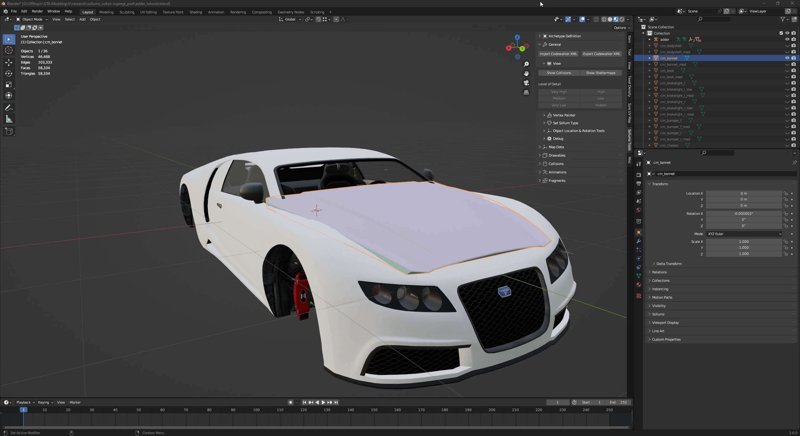

# 📑 Setting up the model and materials

### Importing a model

Without further ado, import a model (from a different game, modelled by yourself) to Blender. In this case, I am going to import the Super GT from GTAIV in `.FBX` format.


You can ditch that part if your vehicle was modelled in Blender.


<figure><figcaption>
Importing a .fbx format file with tutorial vehicle
</figcaption></figure>

As the import has finished, you will see an imported mesh.

<figure><figcaption>
Vehicle mesh after importing process
</figcaption></figure>

### Assigning materials

The subject of consideration for this tutorial is the bonnet part. To assign a material, go to Material tab, click on Browse material button and select the material from the list. In this case, I have assigned a vehicle paint one to the outer part of the bonnet.

<figure><figcaption>
Choosing a vehicle paint material
</figcaption></figure>

The same is true for all the bonnet's materials.
