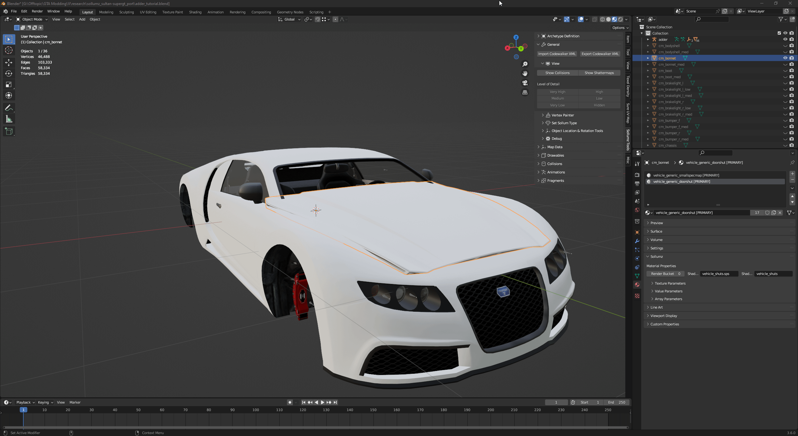
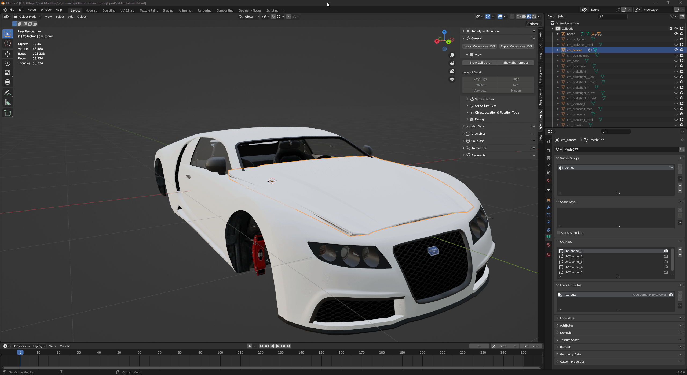
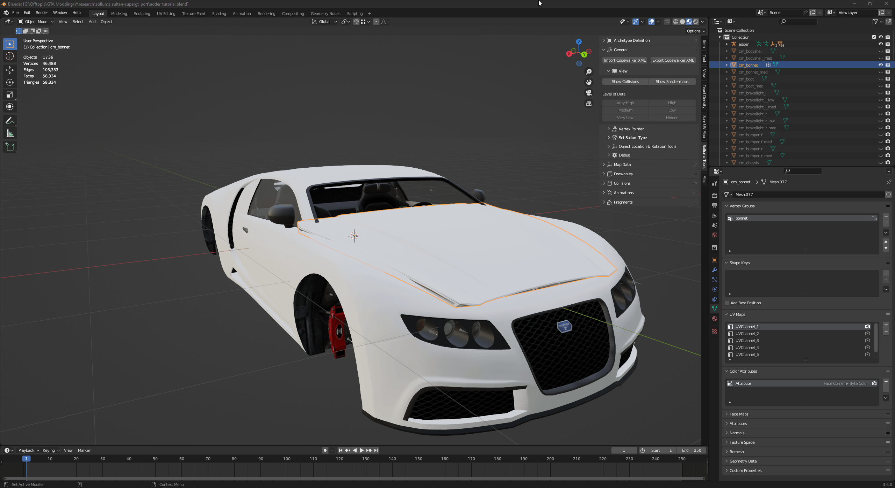
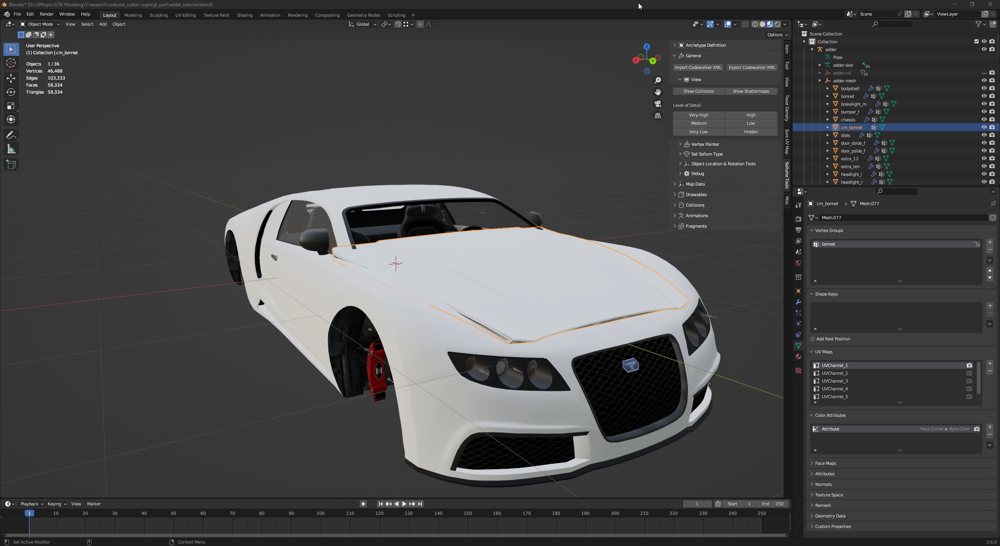
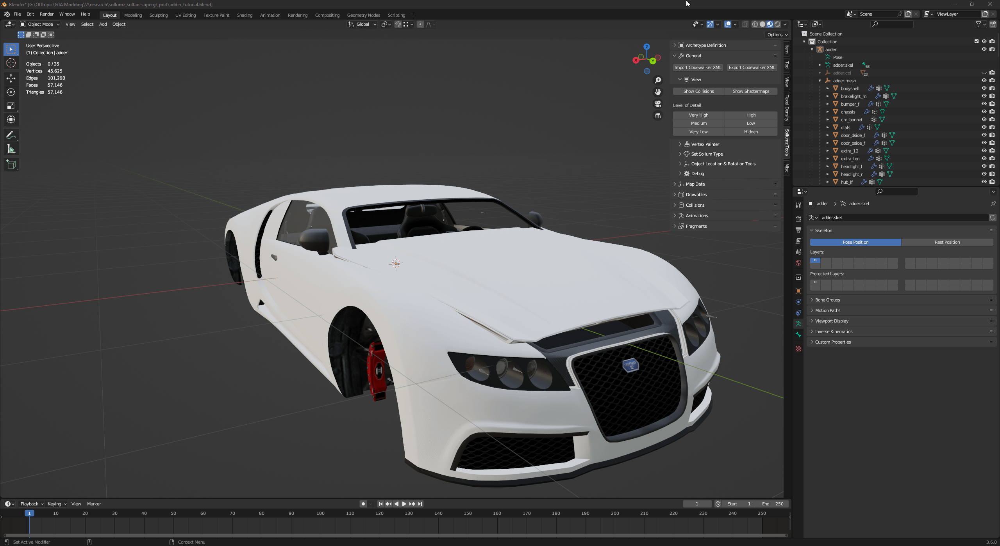

# 🚦 Vertex Groups, hierarchy and armature

### Create and assign Vertex Groups

To create a new vertex group, go to **Data** tab, click `+` in **Vertex Groups**, double click on the Group name and rename it to **bonnet**.

<figure><figcaption>
Process of creating a vertex group
</figcaption></figure>

1. Change **Object Mode** to **Edit Mode.**
2. Switch to **Face Select.**
3. Select all faces by pressing `A` or using the `CTRL+A` shortcut.
4. Go to **Vertex Groups**, click Assign button and exit **Edit Mode**.

Now all of the selected faces are properly set to the **bonnet** vertex group**.**

<figure><figcaption>
Assignment of faces to vertex group
</figcaption></figure>

### Hierarchy

Our new custom bonnet model has to be considered by Sollumz as a valid part, so we have to move the mesh by expanding Adder's armature then drag and drop bonnet's Drawable Model inside `adder.mesh`

<figure><figcaption>
Bonnet part moved into adder.mesh
</figcaption></figure>


You can delete the original bonnet, since is not needed anymore.


<figure><figcaption>
Removal of vanilla bonnet part of adder.
</figcaption></figure>

### Armature

A replacement custom part has also to be linked to the armature, you can do this via **Armature** modifier.

1. Go to **Modifiers** tab.
2. Add an **Armature** modifier.
3. Select your vehicle's armature.

<figure><figcaption>
Armature modifier creation
</figcaption></figure>
